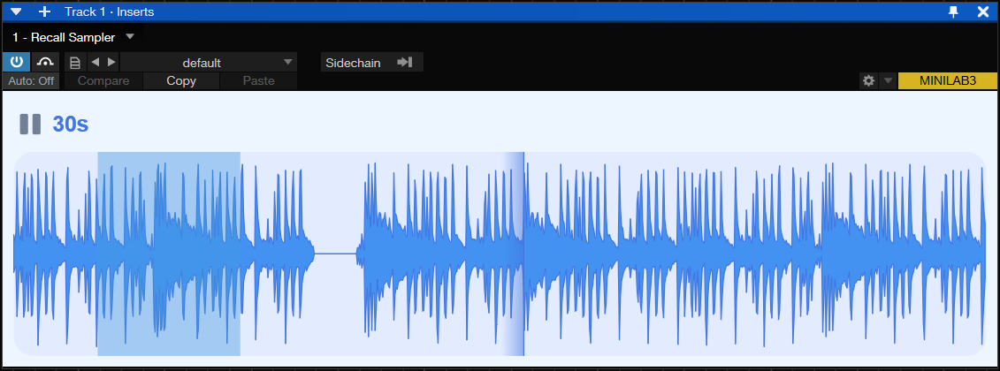

# Recall-Sampler

**Recall-Sampler** is a VST plugin that records everything you play, allowing you to select and drag recorded parts anywhere.  
Inspired by [GlobalSampler](https://www.reapertips.com/post/capture-anything-in-reaper-with-global-sampler) for Reaper and [Rolling Sampler VST](https://www.birdsthings.com/).

---
## Use Cases

- Place Recall-Sampler on the master channel to capture everything.
- Set up an arpeggio or sequence and change synth presets to record glitches.
- Experiment with chainging presets on processing VSTs (reverb, delay, tape plugins, etc.) to capture sounds they make during preset change.
- If you wil run standalone version, you can use it to capture audio from any source on your computer, for example sample YouTube.

## Features

- Free
- Record audio of any desired length
- Drag and drop recorded audio anywhere
- Freeze recording with a button
- Auto-stop after 3 seconds of silence

---

## Building

### Prerequisites

- [JUCE](https://juce.com/get-juce) (includes Projucer)
- A C++17 compatible compiler (Visual Studio 2019/2022, Xcode, or GCC)

### Steps

1. **Open the Project**
   - Launch Projucer.
   - Open the `.jucer` project file.
   - Click **Save and Open in IDE** to generate project files for your platform.

2. **Build the Plugin**
   - The project will open in your default IDE (Visual Studio on Windows, Xcode on macOS).
   - Select your desired configuration (Debug/Release).
   - Build the project using your IDE's build command.
   - The compiled VST3 plugin will be available in the designated build folder.

**Note:** Ensure your IDE and compiler support C++17.

### Supported Formats

- VST3
- Standalone application